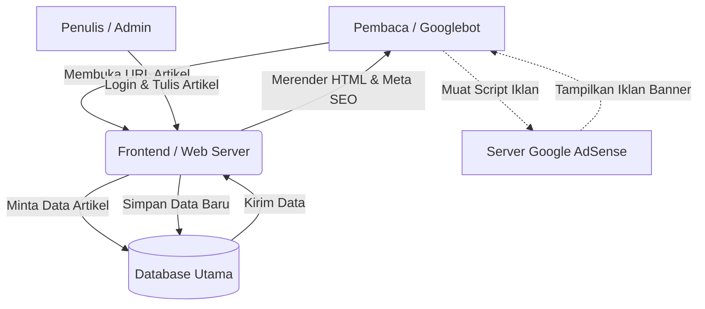
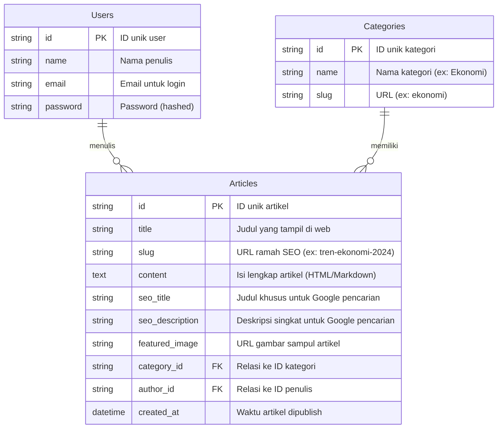

# PRD — Project Requirements Document

## 1. Overview
Di era digital, lalu lintas pencarian organik (dari Google) adalah kunci utama untuk membangun audiens yang besar. Banyak portal berita atau blog gagal mendapatkan pembaca karena struktur aplikasi mereka tidak dioptimalkan untuk mesin pencari. 

Proyek ini bertujuan untuk membangun sebuah portal informasi (mirip portal berita) yang menaungi berbagai kategori seperti Teknologi, Ekonomi, Gaya Hidup, dan lainnya. Fokus utama dari aplikasi ini adalah **SEO-driven (Optimalisasi Mesin Pencari)** agar artikel mudah ditemukan di Google untuk meningkatkan *reach* (jangkauan) dan klik. Selain itu, platform ini dirancang sejak awal agar mudah dimonetisasi menggunakan **Google AdSense**.

## 2. Requirements
Berikut adalah persyaratan utama agar proyek ini dapat berjalan dan mencapai tujuannya:
- **Kinerja Tinggi & Cepat:** Website harus memuat halaman dengan sangat cepat karena kecepatan adalah salah satu faktor utama penentu peringkat SEO Google (Core Web Vitals).
- **Struktur SEO Sempurna:** URL harus ramah SEO (menggunakan slug/kunci kata), mendukung Meta Tag dinamis, Open Graph (untuk *share* sosial media), dan pembuatan otomatis XML Sitemap.
- **Dukungan Monetisasi:** Layout (tata letak) website harus menyiapkan ruang atau *placeholder* khusus yang tidak mengganggu pembaca untuk penempatan iklan (Banner AdSense) di area strategis (header, tengah artikel, sidebar).
- **Responsif (Mobile-First):** Karena mayoritas pencarian dilakukan lewat HP, tampilan website harus sempurna di perangkat seluler.
- **Sistem Manajemen Konten (CMS) Internal:** Harus ada halaman admin sederhana untuk membuat, mengedit, dan mempublikasikan artikel dengan mudah.

## 3. Core Features
- **Manajemen Artikel & Kategori:** Fitur bagi penulis/admin untuk membuat artikel teks yang kaya (menggunakan *rich text editor*) dan mengelompokkannya ke dalam kategori (Ekonomi, Teknologi, dll).
- **SEO Automation Engine:** Setiap kali artikel dibuat, sistem akan otomatis memastikan elemen SEO terpenuhi (contoh: peringatan jika judul terlalu panjang, kolom khusus untuk deskripsi SEO/Meta Description).
- **Sistem Ruang Iklan (Ad Spaces):** Pengaturan tata letak otomatis di mana script Google AdSense dapat disisipkan dengan aman tanpa merusak struktur halaman website.
- **Navigasi & Pencarian Internal:** Kolom pencarian cepat bagi pembaca untuk mencari topik spesifik di dalam portal.
- **Artikel Terkait (Related Posts):** Algoritma sederhana di akhir artikel yang merekomendasikan artikel lain di kategori yang sama untuk menjaga pembaca tetap berada di website (meningkatkan *pageviews*).

## 4. User Flow
**Perjalanan Pembaca (Reader Flow):**
1. **Pencarian:** Pengguna mencari informasi spesifik di Google (contoh: "Tren Ekonomi 2024").
2. **Kunjungan:** Pengguna mengklik tautan artikel web kita di halaman pertama Google.
3. **Membaca & Eksposur Iklan:** Pengguna membaca artikel. Di sela-sela paragraf dan di halaman samping, terdapat iklan dari AdSense.
4. **Eksplorasi:** Selesai membaca, pengguna melihat "Artikel Terkait", lalu mengkliknya dan membaca artikel lain di website kita.

**Perjalanan Admin (Admin Flow):**
1. Admin login ke *dashboard* internal.
2. Memilih menu "Tulis Artikel Baru", memasukkan judul, isi artikel, menempatkan gambar, dan memilih kategori (misal: Teknologi).
3. Mengisi kolom "SEO Tag" untuk optimasi.
4. Menekan "Publish". Artikel otomatis tayang dan Sitemap Google langsung diperbarui.

## 5. Architecture
Sistem akan menggunakan pendekatan **Server-Side Rendering (SSR)**. Artinya, ketika pembaca mengklik tautan, server akan merakit halaman lengkap dengan kontennya sebelum dikirim ke pembaca. Ini adalah metode terbaik agar bot mesin pencari (seperti Googlebot) bisa langsung membaca isi artikel kita dengan sempurna.

## 6. Database Schema
Kita akan menggunakan struktur database relasional yang sederhana namun efektif untuk mengelola artikel, kategori, dan pengguna (penulis).

**Daftar Tabel Utama:**
1. **User (Pengguna):** Menyimpan data admin/penulis.
2. **Category (Kategori):** Menyimpan topik bahasan (Teknologi, Ekonomi, dll).
3. **Article (Artikel):** Menyimpan seluk beluk konten berserta pengaturan SEO-nya.

## 7. Tech Stack
Untuk mencapai target SEO terbaik dan memberikan pengalaman web yang sangat cepat, berikut adalah rekomendasi teknologi yang digunakan:

- **Frontend & Backend (Full-stack Framework):** **Next.js** 
  *Alasan:* Next.js adalah pilihan emas saat ini untuk website yang berfokus pada SEO. Fitur Server-Side Rendering (SSR) dan generasi Meta Tag dinamisnya sangat disukai oleh Google.
- **Styling UI:** **Tailwind CSS + shadcn/ui**
  *Alasan:* Membuat tampilan desain modern, responsif, dan konsisten dengan sangat cepat, sambil menjaga ukuran *file* desain tetap kecil agar web *loading* cepat.
- **Database:** **SQLite**
  *Alasan:* Sangat ringan, cepat, dan murah/gratis untuk memulai. Cukup tangguh untuk portal berita dengan ribuan artikel.
- **ORM (Penghubung Database):** **Drizzle ORM**
  *Alasan:* Sangat optimal untuk Next.js dan menjamin tidak ada kesalahan penulisan kode saat mengambil data artikel dari database.
- **Autentikasi (Sistem Login Backend):** **Better Auth**
  *Alasan:* Solusi keamanan ringan agar hanya admin terdaftar yang bisa masuk ke halaman penulisan artikel.
- **Deployment & Hosting:** **Vercel**
  *Alasan:* Vercel adalah pembuat Next.js. Deploy di sini memastikan website memiliki kecepatan tingkat global secara otomatis (menggunakan *Edge Network*), yang mana akan sangat mendongkrak skor SEO. (Pilihan alternatif murah: VPS Linux sederhana).

